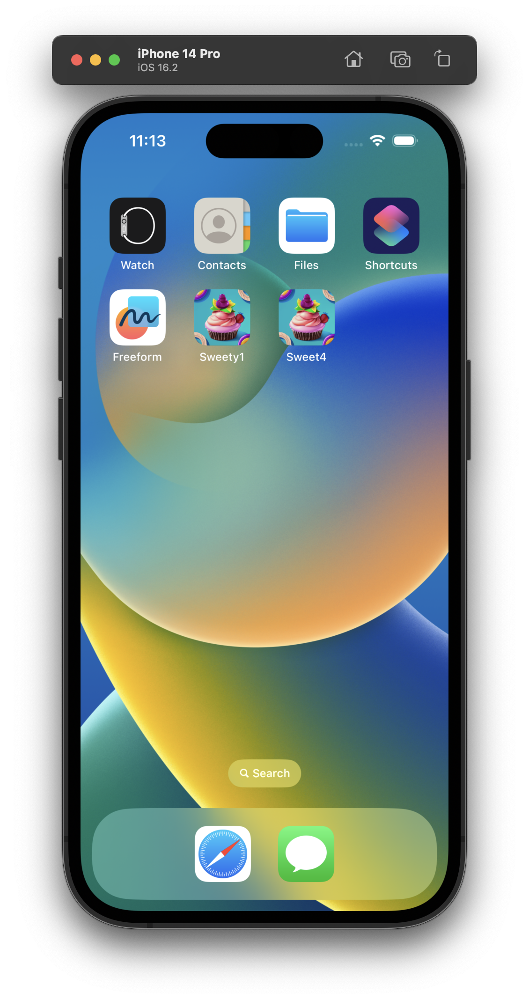
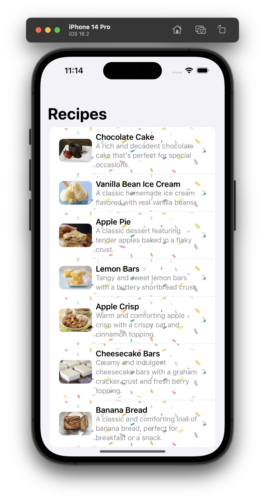
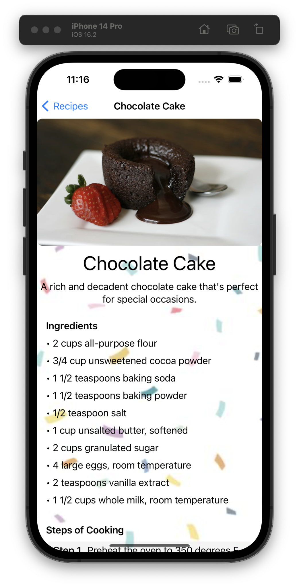
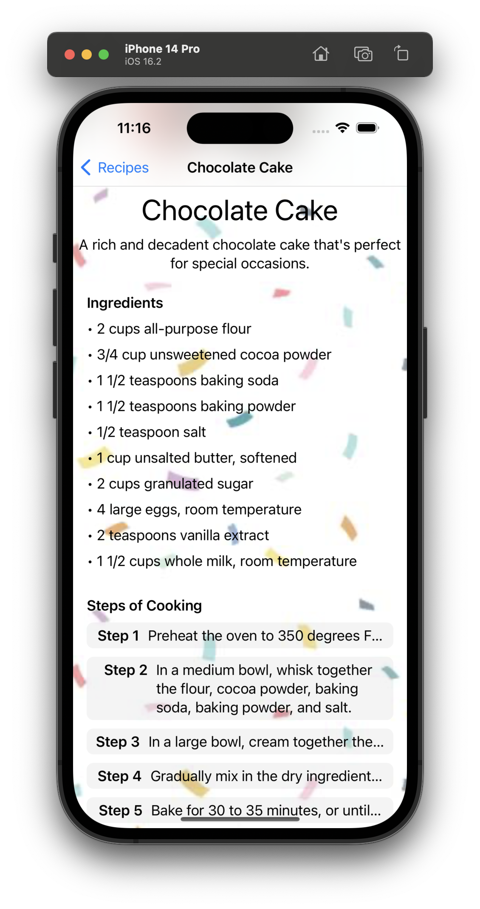

# Sweet App

Sweet App is an iOS app that provides a list of dessert recipes. Users can choose a recipe from the list and view its ingredients and cooking steps.

## Screenshots

## Features
- A list of dessert recipes
- Recipe details page with ingredients and cooking steps

## Technologies Used
- Swift
- SwiftUI

## How to Use
1. Clone the repository
2. Open the project in Xcode
3. Build and run the app on a simulator or device

## Acknowledgements
This app was created as a project for learning Swift and SwiftUI. The recipe data is sourced from `google.com`.

## License
This project is licensed under the MIT License. See the LICENSE file for details.
